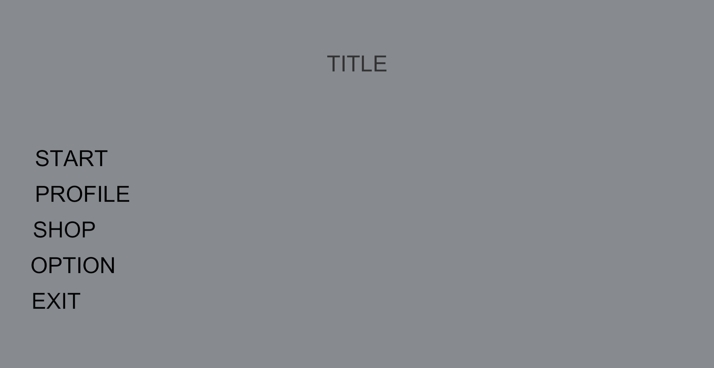
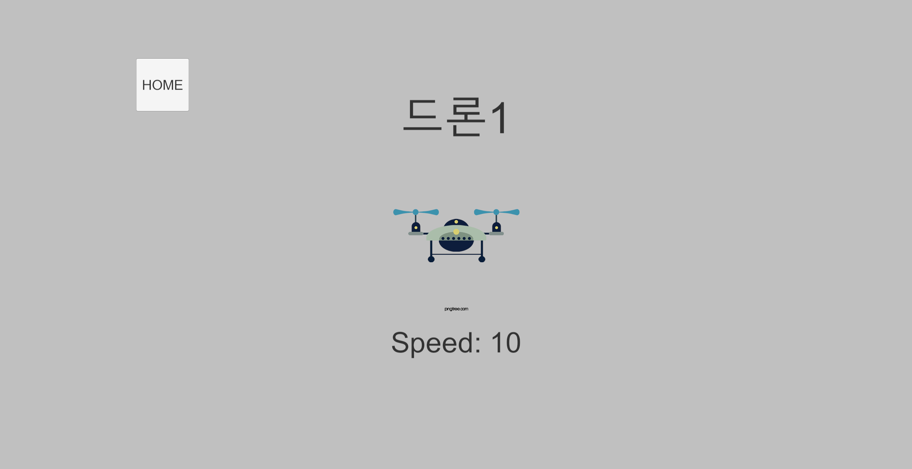
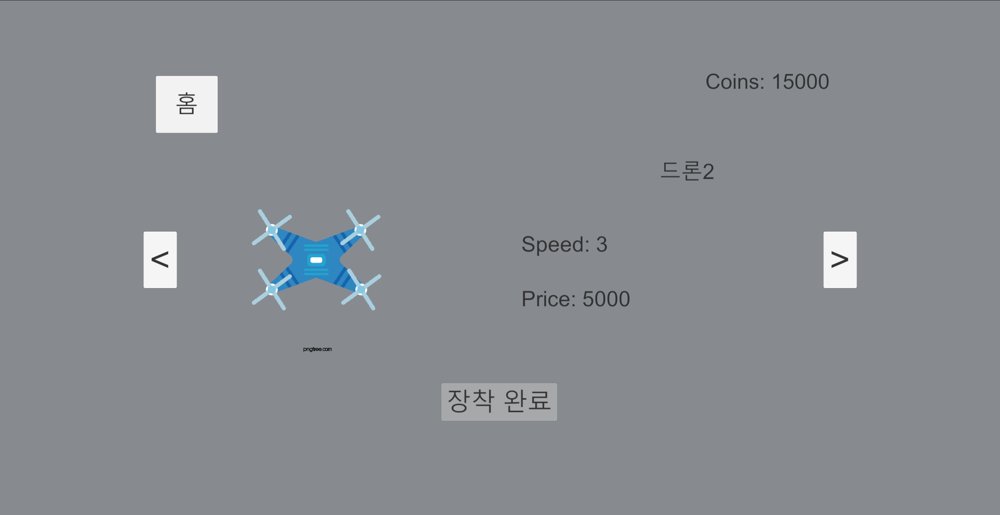
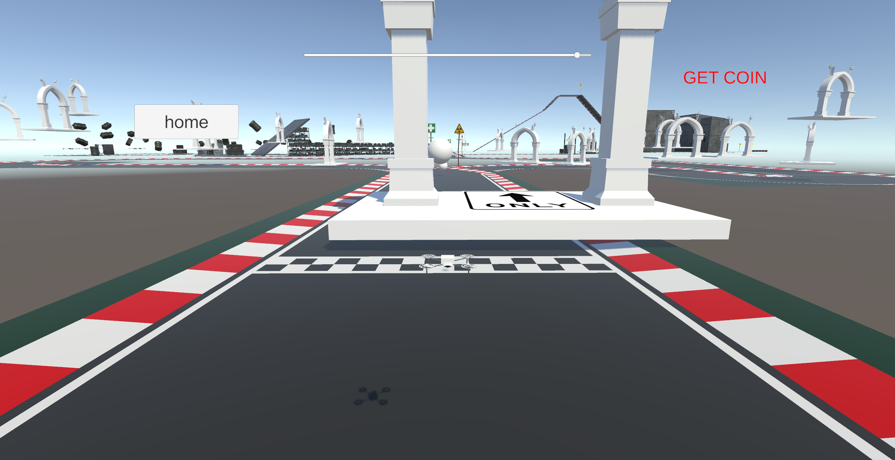
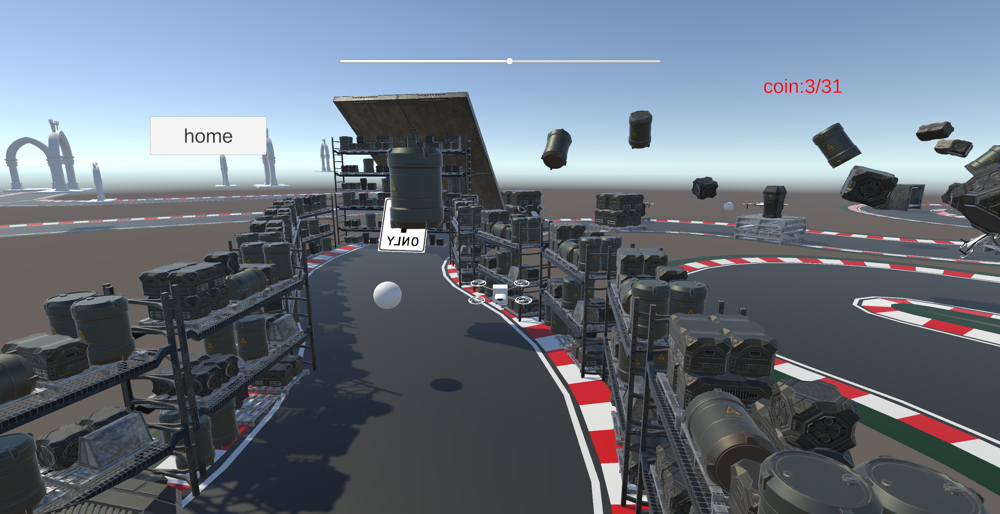
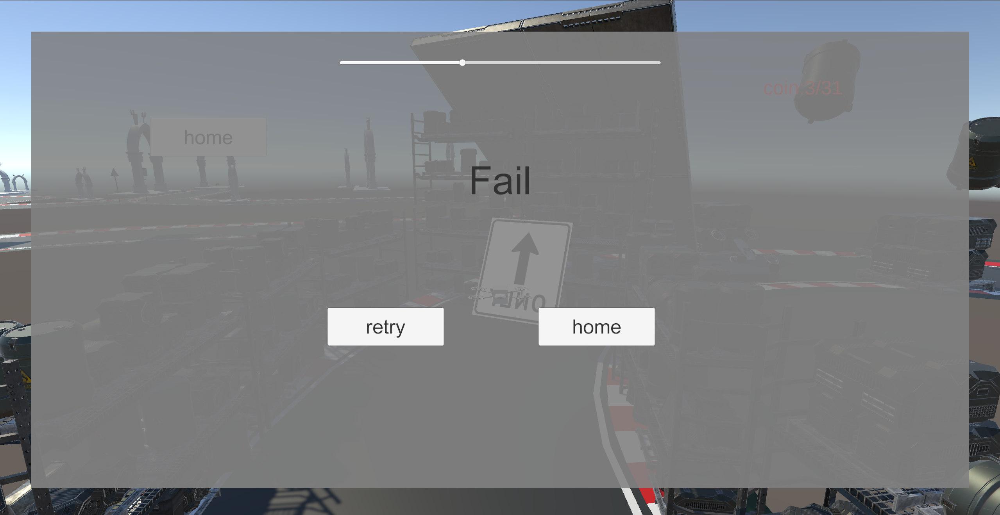

# Dron-Game-Clean

A Unity drone game that lets users fly different types of drones through various challenges, using keyboard controls. The project features a clean UI with shop and profile systems, and a structured level to test control and obstacle navigation.

---

## 🕹️ Controls

| Key         | Action         |
|-------------|----------------|
| W / A / S / D | Move Forward / Left / Backward / Right |
| Space       | Ascend         |
| Left Ctrl   | Descend        |
| Mouse       | Rotate Yaw     |

---

## 🎮 Features

- Multiple drone types with unique speed stats
- In-game shop to equip drones using coins
- Obstacle-based level design
- Fail/Retry system for gameplay loops
- Simple UI and coin collection system

---

## 🖼️ Screenshots

### 🏁 Title Screen


### 👤 Profile Page


### 🛒 Drone Shop


### ✈️ In-Game Play (Part 1)


### ✈️ In-Game Play (Part 2)


### 💥 Fail Screen


---

## 📦 Folder Structure

```
Assets/
├── Scripts/
│   └── Drone/
│       ├── DroneController.cs
│       └── UIManager.cs
├── Scenes/
│   └── MainScene.unity
├── Prefabs/
├── UI/
└── Resources/
```

---

## 🧰 Requirements

- Unity 2021.3 or newer
- Standard Input System

---

## 🚀 How to Run

1. Clone or download this repository
2. Open it with Unity Hub or Unity Editor
3. Open `Scenes/MainScene.unity`
4. Press ▶ Play and enjoy flying drones!

---

